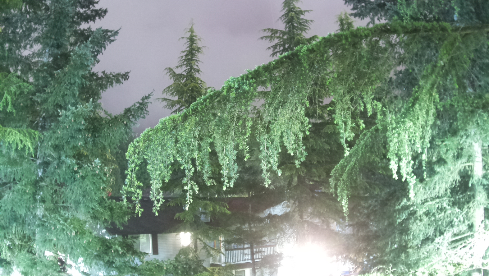

# Raspberry Pi 4 Low Light Photography

## Overview

The reasonably new Raspberry Pi High Quality (HQ) camera allows for some
interesting applications. One of these is long (ish) exposure photography.
With a bit of Python, you can tweak the HQ camera to have exposures up to
six seconds at ISO 800. This allows you to take pictures in almost no light.



The above image was taken in the middle of the night in near complete darkness.
The eposure was 1.5 seconds at ISO 800.

## Hardware

The project is constructed with the following components:

* Raspberry Pi 4 (I use 4GB)
* ICETower Cooling System
* Samsung 256GB Thumb Drive
* ThePiHut HQ Camera Mount Pro
* Pimoroni Black Hat Hack3r
* Pimoroni HyperPixel4 Square Non-Touch (though touch would provide an
opportunity for an interesting user interface)
* Raspberry Pi High Quality Camera
* Raspberry Pi telephoto lens
* Raspberry Pi keyboard and mouse
* Anker Power Bank
* USB-C to USB-C cable
* Raspberry Pi tall GPIO header
* Two 10 cm DuPont male-to-female connectors, one red and one black
* M2.5 brass standoff kit
* Mounting hardware appropriate for your application

You'll also need an external HDMI monitor for the initial configuration.

## Software

* Raspberry Pi OS (I use 32-bit, but 64-bit beta should work)
* The lowlight.py program from this repo

## Construction

1. Attach the Raspberry Pi HQ Camera to the Raspberry Pi 4 using
a 10 to 20 cm ribbon cable. Don't put the lens on yet.
2. Attach the ICETower cooling system on the Pi4 following the
included instruction booklet. Leave off the lowest base plate.
3. Follow the instructions at https://thepihut.com/HQmounntPRO to attach
the camera to the mount, then screw the Pi4-ICETower onto the mount using the
metal screws from the ICETower kit.
4. Put a Raspberry Pi tall GPIO header on the RPi.
5. Attach the Black Hat Hack3r ribbon cable on the tall GPIO header, then plug
the other end into the Hack3r plate.
6. Using long brass standoffs, attach the Hack3r plate to the protruding screws
(yes, I know they're techincally bolts) on the ICETower.
7. Attach the HyperPixel4 display to the Hack3r plate.
8. Use the DuPont jumper wires to extend the fan's power and ground around to the
Hack3r plate 5v and ground pins.
9. Using the Raspberry Pi Imager on some other computer, burn the Raspberry Pi
OS onto the thumb drive.
10. Put the thumb drive in a USB-C port on the Raspberry Pi (It's one with the
blue spacer).
11. Connect the keyboard and mouse to the Raspberry Pi.
12. Connect the temporary monitor.
13. Boot up the Pi and configure it as you normally would. Enable I2C, SPI, and
the camera, at least.
14. Copy lowlight.py onto the Raspberry Pi.
15. Attach the lens.
16. Focus the lens. Honestly, this is the most fiddly bit.

## Operation

Mount the camera. There are a number of ways to do this. Since the longest
exposure is six seconds, you can use a tripod so the camera does not move. This
will cause some star streaking and will make it so you can't do plate alignmnent
and typical astrophotography post-processing.

If you aren't doing astrophotography, you can use a simple tripod. I like the
Gorilla Pods because they're tough, flexible, and small. You just have to be
careful about balancing the camera because it's back-heavy (and the 
HyperPixel4 display will break if it hits the ground). The first image was
shot on a Manfroto lightweight tripod.

If you're doing astrophotography, I recommend a motorized equatorial mount so
the stars will be round and sharp. That way you can take multiple images of the
same part of the sky and stack the images.

Run the camera capture with the command
```
python3 lowlight.py
```
This will write a datestamped JPG image in the current directory. If you want to
change the shutter speed, edit the lowlight.py file. Yes, this is terrible. Yes, I 
intend to make the program more than a fast hack.


## To Do/Future Iterations

1. Build another one and photograph each step to improve this documentation.
2. Improve the lowlight.py program so it allows options, has reasonable
defaults, and is documented. Especially important is acceptance of shutter speed
on the command line.
3. Write code to turn the Raspberry Pi into an access point so you can use an iPad
to control the camera.

